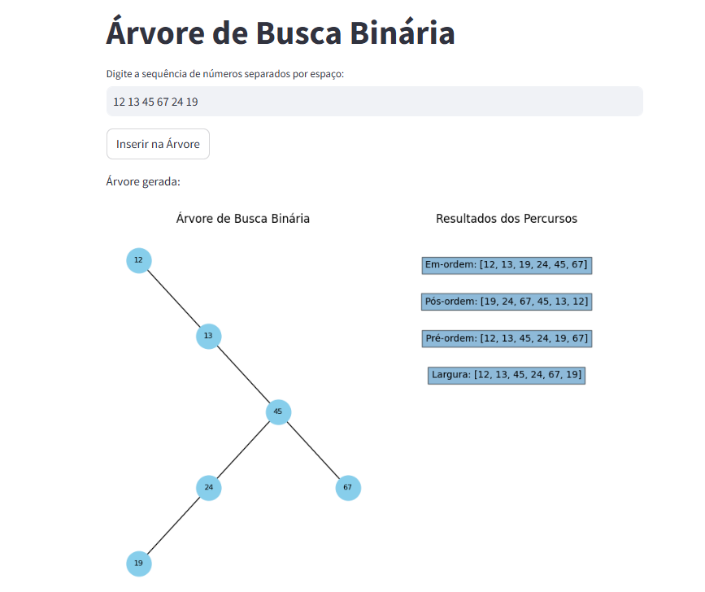

#  Interactive Binary Search Tree Visualization

## Overview
This project is an **interactive visualization** of a **Binary Search Tree (BST)** developed using **Python**, **Streamlit**, **NetworkX**, and **Matplotlib**.  
The application allows the user to enter a sequence of numbers, automatically generates the corresponding binary search tree, and displays its structure along with different **tree traversals**.

---

## Features
-  **Dynamic tree generation** from user input.  
-  **Interactive visualization** built with Streamlit and NetworkX.  
-  Displays **four types of tree traversals**:
  - In-order  
  - Pre-order  
  - Post-order  
  - Breadth-first (level order)  
-  **Real-time graph rendering** using Matplotlib.  
-  Simple and intuitive interface for educational and demonstration purposes.

---

## Application Preview
_Add a screenshot of the application below:_

---
